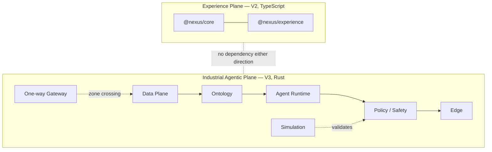
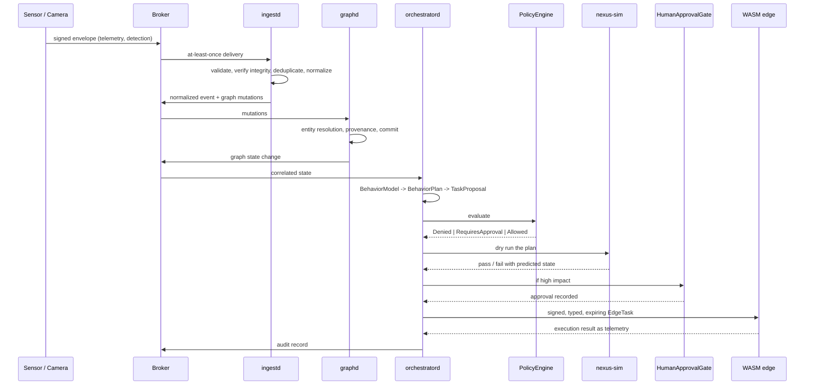
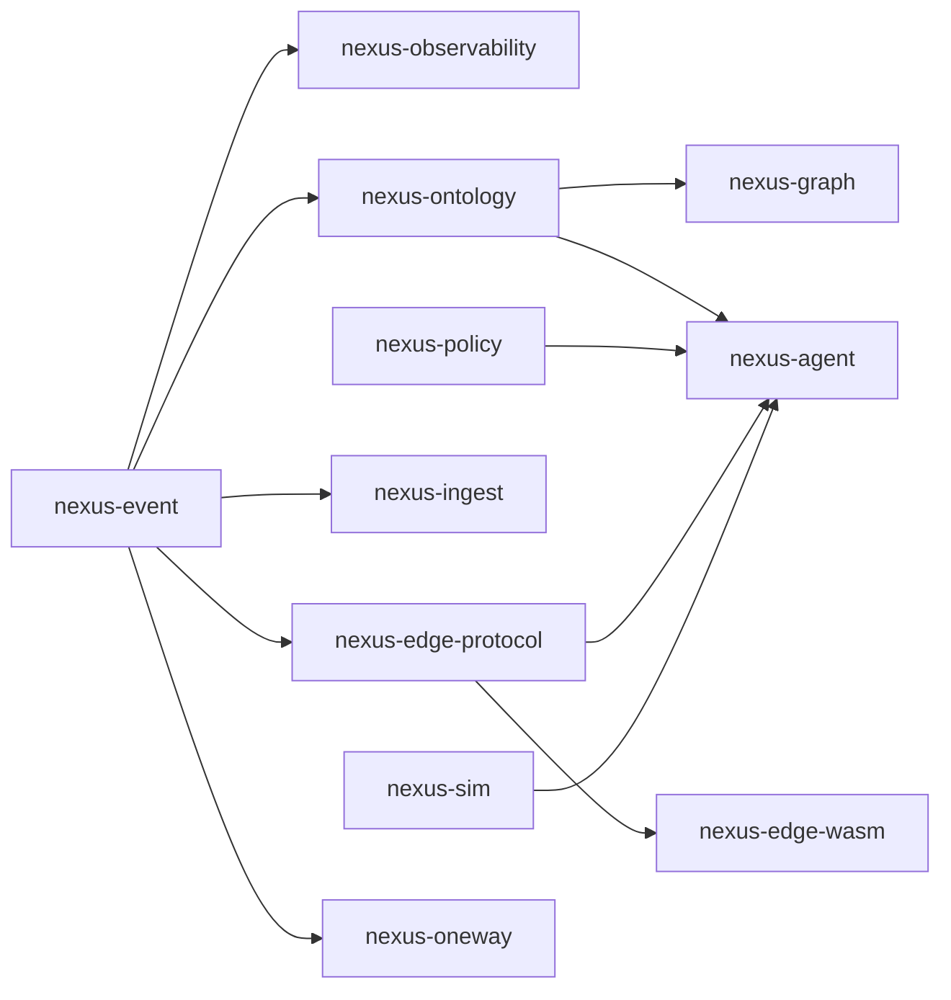

# NEXUS V3 — Industrial Agentic Runtime Architecture

Status: implemented on branch `nexus-v3`. Verification status per gate is in
`NEXUS_V3_VALIDATION.txt`; read it before quoting anything here as tested.

## 1. Why a second plane

NEXUS V2 is an Experience Engine: it decides what a digital experience should
be and compiles it. That plane reasons about design, capability and
originality, and its unit of work is a build.

V3 reasons about physical facilities: sensors, cameras, robots, zones,
incidents and tasks. Its unit of work is an event, and its output can move
matter. The two share almost no non-functional requirement. Experience builds
are allowed to be slow and are never safety-critical; a policy decision that
authorises a robot to move is the opposite on both counts.

Forcing one architecture to serve both would compromise each. So V3 is a
separate plane that shares the repository and nothing else.

The separation is enforced, not asserted: `scripts/v3-architecture-gates.mjs`
fails if a TypeScript file imports from `runtime/`, if a Rust file mentions
React, or if `@nexus/core` gains a runtime reference.

## 2. Conceptual inspiration

Four public bodies of ideas informed the design. None of their code was used
and no equivalence is claimed to any of them.

| Source | Principle taken | Where it lives |
|---|---|---|
| Palantir Gotham | Data fusion, entity resolution, an ontology as the system of record, provenance on every fact | `nexus-ontology` |
| Anduril Lattice | Sensor fusion, situational awareness, task orchestration, coordinating edge devices | `nexus-agent`, `nexus-ingest` |
| Physical Intelligence | A behaviour model as an abstraction, plans validated in simulation before execution | `nexus-agent::behavior`, `nexus-sim` |
| Waterfall-style gateways | Zone separation, telemetry in one direction, no reverse channel in an observation profile | `nexus-oneway` |

What is actually original here is the composition: an ontology whose ports
carry no database, a policy engine whose prohibitions are compiled into the
binary rather than configured, a signed typed command protocol that a sandbox
refuses to exceed, and a simulation step that is a precondition of dispatch
rather than a testing convenience.

## 3. Safety position

The runtime is built for industrial infrastructure, civil robotics,
inspection, maintenance, logistics, defensive monitoring, simulation and
research.

It does not implement, and is constructed to make it hard to add:

- automatic selection of human targets
- targeting, fire control, weapon release, weapon control
- navigation for the purpose of attacking or pursuing people
- lethal autonomy

Three mechanisms, in order of how hard they are to circumvent:

1. **Compiled prohibitions.** `nexus-policy::invariants::check_hard_invariants`
   runs before any configurable rule and can only deny. A permissive rule set
   cannot reach past it — asserted by test.
2. **Closed sets.** `DetectionClass`, `EntityKind`, `RelationKind`,
   `ActionKind` and the edge command set are closed enums whose parsers reject
   unknown values rather than falling back. There is no person-identification
   or tracking class. Adding one is a reviewable source change.
3. **CI gates.** The architecture gate script re-checks that the invariants,
   the prohibited-term list and the closed detection set are still intact.

Any physical action classified `high_impact` additionally requires a recorded
human approval, and any physical action at all requires a safety envelope and
a passing simulation.

## 4. Execution flow

Every arrow that can change physical state passes through policy, and every
step writes to the hash-chained audit trail before the next one begins.

## 5. Crate dependency direction

`nexus-policy` depends on nothing at all — not even `nexus-event`. It is the
layer everything else trusts, so it has the smallest possible surface and can
be reviewed in isolation.

## 6. Concurrency and async

The ports are synchronous. Async is confined to the adapters that genuinely
need it (`rdkafka`, `neo4rs`), each owning its runtime internally.

This is a deliberate inversion of the usual Rust default. Making the ontology,
the policy engine, the orchestrator and the simulator async would colour the
entire codebase for the benefit of two optional adapters, and would make the
deterministic replay in `nexus-sim` substantially harder to guarantee. The
cost is a blocking call inside the adapters; the benefit is that the
safety-critical path is ordinary synchronous code that can be read, tested and
replayed without an executor.

## 7. Relationship to V2

- No Rust crate depends on the frontend.
- `@nexus/core` and `@nexus/experience` do not depend on Rust.
- A future web console may consume runtime APIs. It is out of scope for V3.
- V2's CI pipeline is unchanged and still gates the TypeScript workspace;
  `.github/workflows/rust.yml` gates the runtime separately.

## 8. Documents

| Document | Covers |
|---|---|
| `V3_DATA_PLANE.md` | Envelope, topics, delivery guarantees, backpressure, DLQ |
| `V3_ONTOLOGY.md` | Entities, relations, temporal facts, entity resolution |
| `V3_ORCHESTRATION.md` | Proposals, policy, approval, dispatch |
| `V3_EDGE_RUNTIME.md` | Command protocol and WASM sandbox |
| `V3_ONEWAY_SECURITY.md` | The two gateway profiles and their real limits |
| `V3_PHYSICAL_AGENTS.md` | `BehaviorModel`, safety envelopes, simulation |
| `../security/V3_THREAT_MODEL.md` | Threats, mitigations, residual risk |
| `../security/V3_TRUST_BOUNDARIES.md` | Zones and what crosses them |
| `../research/V3_PERFORMANCE_TARGETS.md` | Method for measuring, not claims |
| `../research/V3_FAILURE_MODES.md` | How each component degrades |
