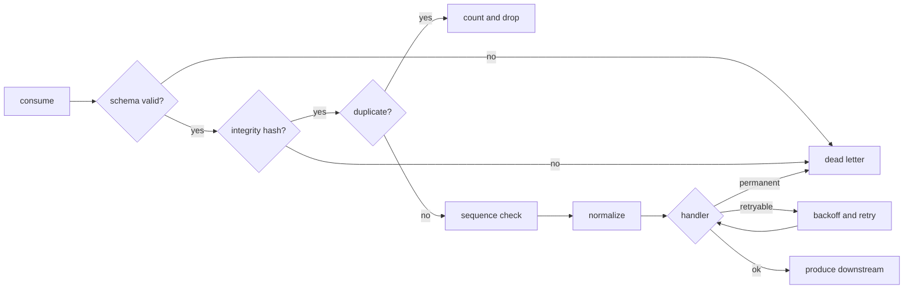

# NEXUS V3 — Data Plane

## 1. The envelope

Everything crossing a boundary is an `EventEnvelope` (`nexus-event`).

| Field | Meaning |
|---|---|
| `event_id` | Unique per envelope |
| `schema_version` | Envelope contract version; `1` today |
| `source_id` | Emitting sensor, camera, robot or service |
| `source_type` | Closed enum; unknown values are rejected, never defaulted |
| `occurred_at` | When the source says it happened |
| `ingested_at` | When the runtime accepted it; set downstream, never by the source |
| `sequence` | Monotonic per `(source_id, stream)` |
| `classification` | `public < internal < sensitive < restricted` |
| `trace_id` | Correlates the whole causal chain |
| `stream` | Logical stream, `[A-Za-z0-9._-]` only |
| `payload` | JSON object |
| `signature` | Optional detached signature over the canonical bytes |
| `integrity_hash` | SHA-256 over the canonical bytes |

`signing_bytes()` deliberately excludes `ingested_at`, the signature and the
hash. An envelope signed at the edge still verifies after the gateway stamps
arrival time — otherwise every hop would invalidate the signature and the
signature would end up being dropped in practice.

Canonical bytes come from a JSON codec with sorted object keys, so two
semantically identical payloads always produce the same hash regardless of
field ordering.

## 2. Delivery guarantees

Stated once, precisely, and not overstated anywhere else in the repository.

| Property | Guarantee |
|---|---|
| Broker delivery | **at-least-once** |
| Graph mutation effect | **effectively-once**, via content-derived `idempotency_key` and the dedup window |
| Ordering | per `(source_id, stream)` only, via `sequence`. No global order exists or is assumed |
| Exactly-once end to end | **not provided** |
| Replay | supported; identifiers are content-derivable |
| Dedup window | bounded, therefore lossy; evictions are counted and exported |

Exactly-once is not provided because the broker offset commit and the graph
write are not in one transaction. Claiming it would require either a
distributed transaction the graph backends do not offer, or a lie. The chosen
alternative is to make every effect idempotent, which gives the property that
actually matters — a duplicate delivery causes no second effect — while being
honest that the duplicate is still delivered.

`SequenceTracker` classifies each arrival as `First`, `InOrder`,
`Gap { missing }` or `Replay { high }`. A gap is loss or in-flight
reordering and is exported as a metric rather than silently tolerated.

## 3. Topics

```text
nexus.telemetry.raw          raw device output, pre-validation
nexus.telemetry.normalized   validated, deduplicated, normalized
nexus.detections             external computer-vision output
nexus.graph.mutations        ontology changes awaiting commit
nexus.task.proposals         orchestration proposals awaiting policy
nexus.audit                  append-only decision record
nexus.deadletter             permanently rejected messages
```

Names live in `nexus_event::topics` so no service can invent one by typo.

`OT_EGRESS_ALLOWLIST` is `telemetry.raw`, `detections` and `audit` only. The
protected zone can produce observations and its own audit trail, and cannot
produce mutations, proposals or anything command-shaped — enforced by the
gateway and asserted by test.

## 4. Ingest pipeline



Retryable and permanent are decided by `NexusError::is_retryable`, and the
split is conservative: only adapter and resource-exhaustion errors retry.
Anything rejected on content grounds goes straight to the dead-letter topic
instead of spinning in a loop that will never succeed.

## 5. Backpressure and resilience

- **Bounded queues.** Every queue has a capacity. Full means the consumer
  stops fetching, which propagates pressure to the broker where it belongs,
  rather than growing memory until the process is killed.
- **Exponential backoff with jitter**, capped at `NEXUS_RETRY_MAX_MS`.
- **Circuit breaker** per downstream. After consecutive failures it opens,
  sheds load, and half-opens to probe recovery.
- **Bulkhead separation** so a slow graph cannot starve detection processing.
- **Crash-safe spool** on the gateway, so an outage buffers to disk within a
  byte cap instead of losing telemetry or growing without limit.
- **Graceful shutdown**: stop fetching, drain in flight, commit offsets, exit.

## 6. Configuration

Everything is environment-driven, documented in `runtime/.env.example`. There
are no credentials in the repository and no default that is a credential: a
service that needs a secret and cannot find one fails to start. The
architecture gate scans for literal credentials and committed `.env` files.

## 7. Kafka / Redpanda adapter

`nexus-ingest` defines the ports (`MessageBus`, `Consumer`, `Producer`) and
ships an in-memory implementation used by CI and the offline demo. The
`kafka` feature provides the `rdkafka` adapter: consumer groups, manual offset
commit after successful processing, producer with delivery confirmation,
dead-letter production, and shutdown on signal.

The adapter has not been compiled in the environment where it was written; see
`NEXUS_V3_VALIDATION.txt`.
