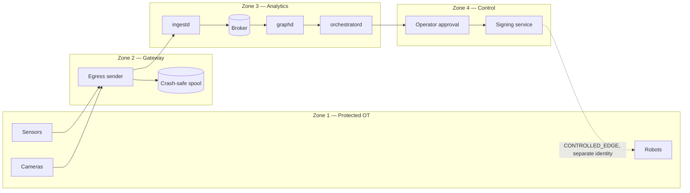

# NEXUS V3 — Trust Boundaries

## 1. Zones

## 2. What crosses each boundary

| Boundary | Direction | Permitted | Control |
|---|---|---|---|
| OT → Gateway | one way | telemetry, detections, audit | topic allowlist, classification ceiling |
| Gateway → Analytics | one way | signed envelopes | signature validation, integrity hash, dedup |
| Analytics → Control | request | task proposals | policy decision required |
| Control → OT | separate channel | signed typed `EdgeTask` | mTLS, separate identity, nonce, expiry, approval |
| Analytics → OT | **never** | — | no path exists |

The last row is the important one. There is no code path from the analytics
zone to an actuator. Control originates in zone 4 with its own identity, over
the `CONTROLLED_EDGE` profile, never through the observation path.

## 3. Trust assumptions

| Component | Trusted for | Not trusted for |
|---|---|---|
| Sensor / camera | reporting its own readings | truthfulness under compromise |
| External vision model | proposing detections | correctness; confidence is provenance, not fact |
| `BehaviorModel` | proposing plans | authorising anything |
| Gateway | forwarding, not modifying | resisting host compromise |
| `graphd` | sole writer to the ontology | resolving ambiguity without review |
| Operator | approving within their role | bypassing hard invariants |
| WASM module | executing inside the sandbox | anything outside its capability tokens |

Nothing is trusted to be safe by intent. The `BehaviorModel` line is the
clearest expression of the design: the component most likely to be replaced by
a learned system in future is the one trusted least.

## 4. Identity separation

Telemetry signing identity, edge command signing identity and operator
approval identity are three distinct sets of key material. Compromising the
telemetry key allows lying about the world; it does not allow commanding a
device.

## 5. Classification

`public < internal < sensitive < restricted`, ordered so a gateway can refuse
anything above its ceiling. An unknown classification string is rejected at
parse time rather than defaulted, so a mislabelled event fails closed.
